# Modelos de previsão da movimentação dos esporos do fungo causador da ferrugem asiática da soja

## Problema:
A ferrugem asiática, causada pelo fungo _Phakopsora pachyrhizi_ é uma das doenças mais preocupantes e limitantes da produtividade das lavouras no sul do país. O ciclo da doença está centrado em uma interação complexa do fungo e o hospedeiro, neste caso, a plantas de soja. O sucesso de contaminação e alastramento da doença nas regiões produtoras depende da germinação de esporos, junto com a dispersão feita principalmente por vias aéreas.

## Objetivo:
O projeto objetiva construir um modelo de movimentação de esporos da ferrugem asiática, a fim de auxiliar na avaliação do risco da presença da doença na região e agilizar o manejo precoce exigido feito com fungicidas.

## Dados utilizados para a construção dos modelos:
Os dados utilizados para a construção dos modelos foram obtidos através de um sistema de monitoramento de esporos da ferrugem asiática, que consiste em um conjunto de armadilhas de captura de esporos, instaladas em diferentes regiões produtoras de soja no Paraná. As armadilhas são compostas por um funil, que direciona os esporos para um tubo de coleta, onde são depositados em uma lâmina de vidro. As lâminas são coletadas manualmente e enviadas para análise em laboratório, onde são contados os esporos presentes em cada lâmina. Os dados utilizados para a construção dos modelos são localização geográfica da armadilha (Latitude, Longitude), data da detecção do primeiro esporo e a situação que se encontra o coletor ("Com esporos" ou "Encerrado sem esporos").

Exemplo de dados coletados (safra 20/21):

|Macro|Regiao                       |Cidade|Produtor-Instituicao                         |Cultivar                          |Situacao             |Primeiro_Esporo|Estadio Fenologico|LongitudeDecimal|LatitudeDecimal|
|-----|-----------------------------|------|---------------------------------------------|----------------------------------|---------------------|---------------|------------------|----------------|---------------|
|Norte|Londrina                     |Rolandia|Renato / IDR-Parana                          |BMX Potencia RR                   |Com esporos          |11/12/20       |V2                |-51.4721866823958|-23.1838722513043|
|Norte|Londrina                     |Ibipora|Zelindo Fernandes                            |BMX Potencia RR                   |Com esporos          |11/12/20       |V1                |-50.9688991560185|-23.1808556429006|
|Norte|Londrina                     |Tamarana|Rogerio Martins da Silva                     |                                  |Com esporos          |11/12/20       |V8                |-51.048526880485|-23.7290592665174|
|Oeste|Cascavel                     |Catanduvas|Maria de Lourdes Loureiro Bordim             |DM53i54                           |Com esporos          |15/12/20       |R5.1              |-53.1112956149411|-25.0979941354739|
|Centro Sul|Ponta Grossa                 |Arapoti|Evandro Pontes de Oliveira                   |NA 5909 RG                        |Com esporos          |17/12/20       |R1                |-49.8919884505616|-24.0914235035692|

### Procedimentos realizados nos dados para utilização nos modelos:

1. Padronização das colunas a serem utilizadas nos modelos:
    - LatitudeDecimal: Latitude em graus
    - LongitudeDecimal: Longitude em graus
    - Primeiro_Esporo: Data no formato (DD/MM/AA ou `%d/%m/%y` do Python)
    - Situacao: Com esporos ou Encerrado sem esporos
    - InicioCiclo: Dia 11/09/20xx (xx é substituído de acordo com a safra)
    - DiasAposInicioCiclo: Quantos dias depois do InicioCiclo se passaram até que o primeiro esporo foi detectado (caso não haja infecção, o valor é -1)
2. Normalização das datas de detecção do primeiro esporo:
    A data definida na coluna InicioCiclo (11 de setembro) foi encontrada nesta [notícia](https://globorural.globo.com/agricultura/soja/noticia/2023/07/governo-encurta-janela-de-plantio-de-soja-em-mato-grosso-parana-e-rio-grade-do-sul.ghtml) disponibilizado pelo Ministério da Agricultura.
3. Passagem de uma malha sobre o mapa do Paraná a fim de uniformizar a localização geográfica dos coletores
    - Divisão do estado do Paraná em regiões retangulares (dimensões do estado do Paraná = 735.1995280519512 km x 468.1821515409006 km). Os testes realizados neste repositório dividiram o estado em 31 partes horizontais e 23 partes verticais, criando retângulos de dimensões 23.71611380812746 km x 20.35574571916959 km. É importante ressaltar que é possível alterar o número de divisões horizontais e verticais por meio do da função `grid_region` presente no arquivo `utils.py`.
    - União dos pontos internos a cada retângulo criando assim o ponto representante seguindo algumas regras:
        1. O ponto será localizado no centro do retângulo.
        2. A situação do ponto será definida como 'Encerrado sem esporos' por padrão, mas se __qualquer__ um dos pontos detectar esporos, a situação do ponto será definida como 'Com esporos'.
        3. A data `Primeiro_Esporo` do ponto será definida como a data mais antiga entre os pontos que detectaram esporos (por exemplo, ponto A detectou no dia 21/10/2021 e ponto B detectou no dia 07/11/2021, a data escolhida será dia 21/10/2021).
        4. A coluna `DiasAposInicioCiclo` será definida como a diferença entre a data `Primeiro_Esporo` e a data `InicioCiclo`, resultando assim em um número inteiro positivo.
    - Exemplo de dados após a passagem da malha:

|LatitudeDecimal    |LongitudeDecimal   |Primeiro_Esporo|Situacao             |InicioCiclo|DiasAposInicioCiclo|
|-------------------|-------------------|---------------|---------------------|-----------|-------------------|
|-24.616708584999948|-54.301019331274155|10/02/21       |Com esporos          |10/09/20   |153                |
|-24.434063939695594|-54.30101933127416 |               |Encerrado sem esporos|10/09/20   |-1                 |
|-24.251419294391244|-54.301019331274155|08/02/21       |Com esporos          |10/09/20   |151                |
|-24.068774649086897|-54.30101933127416 |04/01/21       |Com esporos          |10/09/20   |116                |
|-25.52993181152169 |-54.088223334790285|17/02/21       |Com esporos          |10/09/20   |160                |

4. Criação de datasets com aprendizagem de data utilizando dados já normalizados com a malha (lembrando que os testes realizados até a criação deste README.md utilizaram a proporção 31_23).

    Foram utilizados datasets de 3 safras para a confecção das seguintes tabelas:

    - Média __aritmética__ dos dias de detecção do primeiro esporo para cada ponto da malha
    - Média __geométrica__ dos dias de detecção do primeiro esporo para cada ponto da malha
    - Média __harmônica__ dos dias de detecção do primeiro esporo para cada ponto da malha

    - Existem 4 cenários possíveis durante o processo de criação das tabelas com as 3 médias (aritmética, geométrica e harmônica):
        1. O ponto nos 3 anos detectou esporos: Neste caso, os processos de criação das tabelas com as médias aritmética, geométrica e harmônica são realizados normalmente.
        2. O ponto detectou esporos apenas em 2 dos 3 anos: Neste caso, os processos de criação das tabelas com as médias aritmética, geométrica e harmônica são realizados normalmente, porém, o ano em que o ponto não detectou esporos é desconsiderado no cálculo das médias.
        3. O ponto detectou esporos apenas em 1 dos 3 anos: Neste caso, o valor colocado na tabela será o valor do ano em que o ponto detectou esporos.
        4. O ponto não detectou esporos em nenhum dos 3 anos: Neste caso, o valor colocado na tabela será -1.

## Modelos criados:

- Observação 1: Os modelos foram criados utilizando a linguagem de programação Python com o auxílio das bibliotecas Shapely, Pandas, GeoPandas.
- Observação 2: Será utilizado o termo "ponto" para se referir aos pontos da malha criada (que representam os coletores).
- Observação 3: A fim de facilitar o entendimento do leitor, será utilizado terminologias como safra A, B e C.
- Observação 4: Todos os modelos de crescimento seguem uma função de crescimento logarítmica definida como `tamanho_do_buffer = log(dia, base)`, onde dia se refere há quantos dias a geometria está crescendo com um limite de 105 dias, e as bases utilizadas foram encontradas por meio de testes de tal forma que se consiga valores de 20km, 25km, 30km, 35km, 40km, 45km, 50km, 55km e 60km no último dia do teste (número encontrado como o tempo de esporulação do fungo, disponível [aqui](https://ourofinoagro.com.br/pragas/ferrugem-asiatica-da-soja/) e [aqui](https://www.agrolink.com.br/noticias/agressividade-da-ferrugem-asiatica_475381.html))
- Observação 5: O laço de repetição irá durar 137 dias. (número encontrado como o limite superior do grupo de maturação médio da soja no estado do Paraná, disponível [aqui](https://www.siagri.com.br/plantacao-de-soja/) no tópico 2 do site).
- Observação 6: A conversão de graus para km foi feita baseada em 1 grau = 111.11km (disponível [aqui](https://www.teleco.com.br/tutoriais/tutorialsmsloc2/pagina_5.asp#:~:text=Cada%20grau%20de%20uma%20latitude,a%20aproximadamente%20111%2C11%20km.)). 

1. Modelos circulares: Supondo que os esporos do fungo se movimentam no formato de um círculo, os modelos circulares foram criados com o objetivo de prever a movimentação dos esporos do fungo com raios dos círculos variando no intervalo [20, 60] km com passos de 5 km.

2. Modelos com outros formatos: Modelos com outros formatos foram criados com o objetivo de prever a movimentação dos esporos do fungo com formatos variando no intervalo [20, 60] km com passos de 5 km. Nesta abordagem, a tentativa foi de encontrar um formato que se encaixasse melhor nas tendências de movimentação dos esporos do fungo.

Todas as formas utilizadas para realizar as simulações neste projeto seguiram as seguintes regras:
- Círculos: O centro do círculo é o ponto em que o primeiro esporo foi detectado e o raio do círculo é incrementado diariamente de acordo com a função logarítmica definida na observação 4.
- "Carrapichos": Parâmetros a serem explicados na próxima seção como `raio_de_abrangencia_imediata` e `raio_de_possivel_contaminacao` foram setados como `log(2, base)` e `log(105, base)` respectivamente.

### Modelos sem aprendizagem de data:

- CGT (_Circular Growth Touch_): 
    1. Usando `k` primeiros pontos da safra A para tentar prever a movimentação dos esporos nas safras B e C, iniciaremos a simulação de crescimento crescendo esses `k` primeiros no dia correto (por exemplo: `k = 3`, os valores presentes na coluna `DiasAposInicioCiclo` são 1,3,5; no dia 1, o círculo de infecção do ponto 1 crescerá, no dia 3, o círculo de infecção do ponto 2 crescerá, no dia 5, o círculo de infecção do ponto 3 crescerá).
    2. A partir do dia `k+1`, o crescimento dos círculos de infecção será feito de acordo com a função logarítmica definida na observação 4.
    3. Caso algum círculo de infecção cresça e toque em algum outro ponto `x`, um novo círculo de infecção será criado e a partir do próximo dia, irá crescer juntamente com todos os outros ativos no momento. O ponto `x` guardará o dia em que foi detectado.

### Modelos com aprendizagem de data:

- CGNT (_Circular Growth no Touch_): 
    1. Todos os círculos de infecção serão ativados apenas nos dias corretos (da mesma maneira que o CGT).
    2. A partir do dia `k+1`, o crescimento dos círculos de infecção será feito de acordo com a função logarítmica definida na observação 4.
    3. Caso algum círculo de infecção cresça e toque em algum outro ponto `x`, esse ponto `x` guardará apenas o dia em que foi detectado e não criará um novo círculo de infecção. (Por isso o nome _no touch_)

- MG (_Mixed Growth_):
    - Basicamente uma mistura de CGNT e CGT, onde os círculos de infecção ou serão ativados por data, ou por toque, o que acontecer primeiro.

- TG (_Topology Growth_):
    - Opera da mesma maneira que o CGNT, a diferença está na construção da geometria. Ao invés de utilizar círculos, a geometria é construída utilizando o conceito de "carrapichos" (explicado na seção x).

## Penalização dos modelos:

Algumas maneiras de penalizar os modelos considerando tempos de detecção foram elaboradas, a seguir serão explicadas as penalizações utilizadas neste projeto e o significado de cada termo da matriz de confusão:
- Observação 1: Todas os valores de penalização são resultantes do RMSE. 

### Significado da matriz de confusão:

Verdadeiro positivo - True Positive (TP): O modelo diz que no local existem esporos, e realmente existem de acordo com o dataset de teste.

Verdadeiro negativo - True Negative (TN): Não foi utilizado nesse trabalho, uma vez que o modelo não diz que no local não existem esporos.

Falso positivo - False Positive (FP): O modelo diz que no local existem esporos, mas não existem de acordo com o dataset de teste.

Falso negativo - False Negative (FN): O modelo diz que no local não existem esporos, mas existem de acordo com o dataset de teste.

### Penalização TPP (_True positive penalty_):

    Delta = |Data descoberta - data real|^2

### Penalização TNP (_True negative penalty_):

    Não utilizado neste trabalho.

### Penalização FPP (_False positive penalty_):

    Delta = |Data final - data descoberta|^2

### Penalização FNP (_False negative penalty_):

    Delta = |Quantidade de dias que seriam necessários para chegar até o determinado coletor partindo do coletor verdadeiro positivo mais próximo|^2

- É de suma importância ressaltar que essa penalidade indica se o modelo conseguiu detectar todos os coletores que foram infectados. Qualquer valor diferente de zero indica que o modelo não está sendo suficiente para detectar todos os coletores que foram infectados!

## Construção do modelo TG (_Topology Growth_):

A fim de testar outras geometrias para simular a movimentação dos esporos, foi empregado a ideia de topologias de crescimento para a criação de novas formas de crescimento.

### Definição do grafo de propagação:
Levando em consideração as datas de infecção dos coletores, foi criado um grafo de propagação onde os vértices são os coletores e as arestas são os possíveis caminhos de infecção entre os coletores. Em relação as arestas, considere 2 coletores u e v, onde primeiro houve infecção do coletor u e depois no v, dependendo da distância entre esses coletores e a diferença de datas, pode-se dizer que o coletor u teve influência sobre a presença de esporos sobre o coletor v.

Alguns termos devem ser definidos para a construção do grafo de propagação:

#### Área de abrangência imediata (utilizada posteriormente como RAI - raio de abrangência imediata)

- Definida como uma circunferência de raio RAI, centrada no coletor. Essa circunferência será distorcida a fim de gerar o buffer com as novas geometrias.

#### Área de potencial contaminação direta (utilizada posteriormente como RPC - raio de potencial contaminação)

- Definida como uma circunferência de raio RPC centrada no coletor. Esse parâmetro define os critérios de poda de arestas no grafo de propagação.

### Topologia de crescimento:
- Pode-se entender esse conceito como esqueleto resultante da construção e elaboração do grafo. Ela é constituída como um conjunto de segmentos que possuem origem em um ponto (x,y) e cada um dos segmentos apontam para outros coletores que satisfazem as condições de distância e diferença de datas. O comprimento do segmento é influenciado pela diferença de datas entre os coletores e a distância entre eles, sendo que quanto maior o comprimento, menor o tempo de infecção entre os coletores.

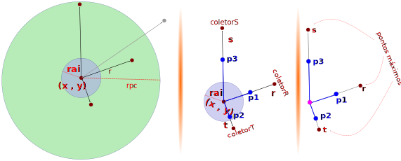

#### Formato utilizado no modelo TG:

O formato utilizado no modelo TG é basicamente a união de um círculo de raio r com um triângulo criado pela interpolação apontando para cada coletor que foi identificado como possível influência de infecção.

<div style="display:flex;">
    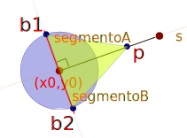
    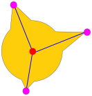
</div>

#### Parâmetros utilizados no modelo TG:

- Raio de abrangência imediata (RAI): `log(2, base)`
- Raio de potencial contaminação (RPC): `log(105, base)`
- Largura do segmento: 0.01
- Proporção aumentada a cada dia no comprimento: 1.06
- Proporção aumentada a cada dia na largura: 1.04

## Bases utilizadas na função logarítmica para realizar as simulações de crescimento no estado do Paraná:

|Km|Base|
|-|-|
|20km|169323466473.21405|
|25km|961554092.8640003|
|30km|30606342.505|
|35km|2608613.8780000005|
|40km|411489.3269999999|
|45km|97845.52200000003|
|50km|31008.934999999983|
|55km|12110.717000000004|
|60km|5532.2990000000045|

## Exemplos de simulações (imagens ao final da simulação):
<div style="display:flex;">
    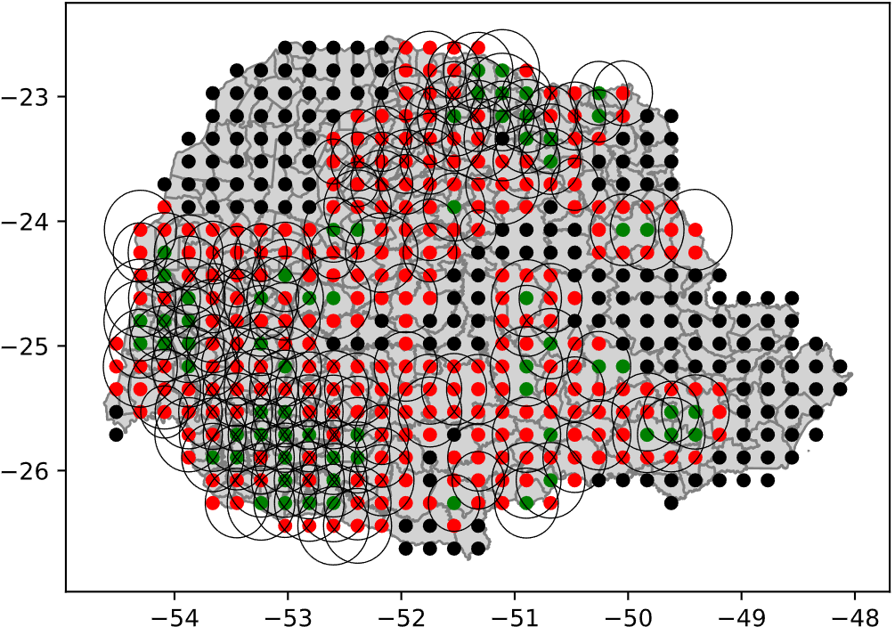
    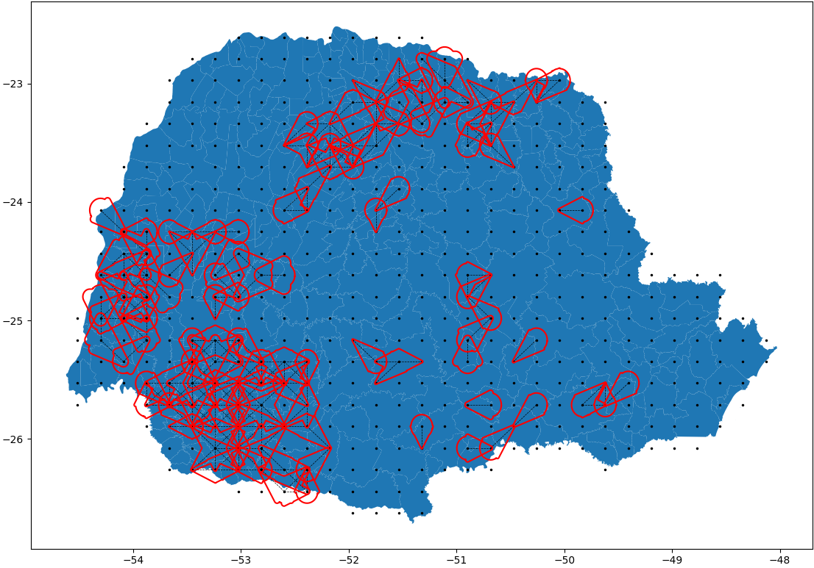
</div>

A primeira imagem é com os círculos, e a segundo é com as geometrias aprendidas.


## Resultados obtidos:

### Dispersão dos dados:

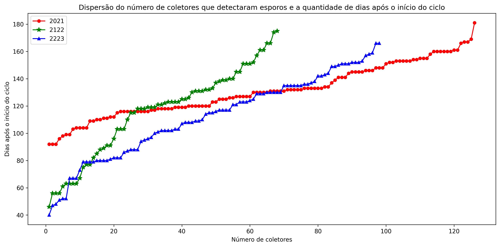

Pode-se observar que a safra 2021 possui uma quantidade de pontos muito maior que as outras safras, isso se deve ao fato de que durante a safra 2021, a contaminação dos coletores foi muito maior que nas outras safras.

### Melhor média:

Utilizando nossas penalidades expostas acima (TPP, FPP e FNP), foi possível obter os seguintes resultados:
Dos 3 modelos com aprendizado (CGNT, MG e TG), 5 em 6 dos rankings, foi observado que a **média aritmética** obteve as menores penalidades em relação às outras médias (geométrica e harmônica).

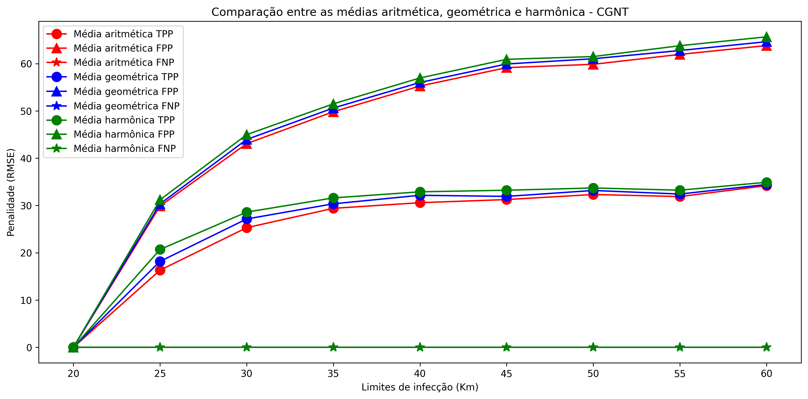

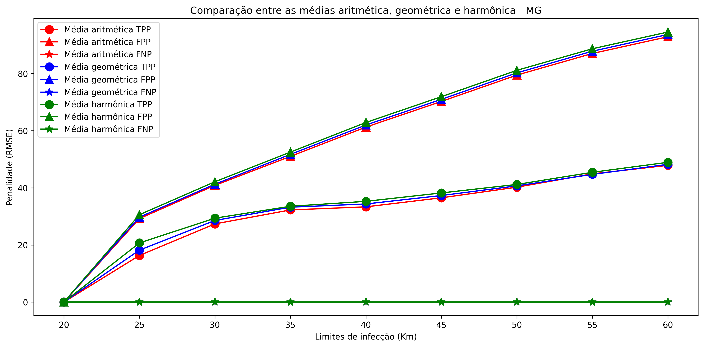

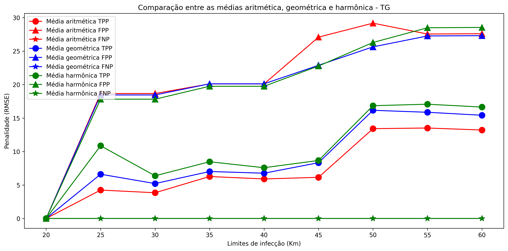


#### Rankings que a média aritmética ganhou:

- TPP CGNT
- FPP CGNT
- TPP MG
- FPP MG
- TPP TG


### Falsos negativos [CGT (_Circular Growth touch_)]:

Das métricas obtidas, apenas os testes com os raios 55 e 60km foram capazes de detectar todos os coletores que haviam sido infectados. Isso pode ser observado nos resultados onde FNP == 0 (lembrando que essa métrica indica se o modelo conseguiu detectar todos os coletores que foram infectados):

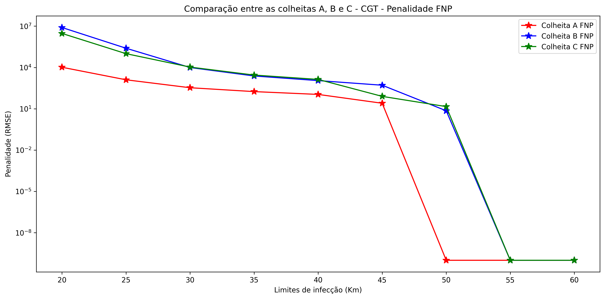

### Falsos positivos:

- O modelo com aprendizagem de data e geometria (TG) foi o melhor modelo em relação a quantidade de falsos positivos, uma vez que por crescer somente direcionado aos coletores que foram infectados, diminuindo assim a quantidade de falsos positivos.
- A mistura de crescimento por data junto com crescimento por toque (MG) piorou a quantidade de falsos positivos, uma vez que o crescimento por toque possui uma tendência de crescer mais rápido que o crescimento por data, o que pode gerar falsos positivos. 

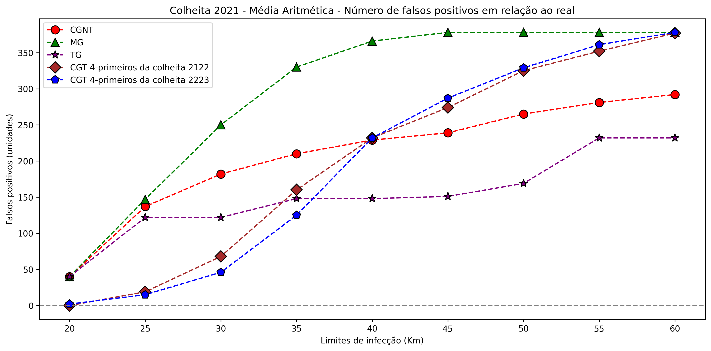
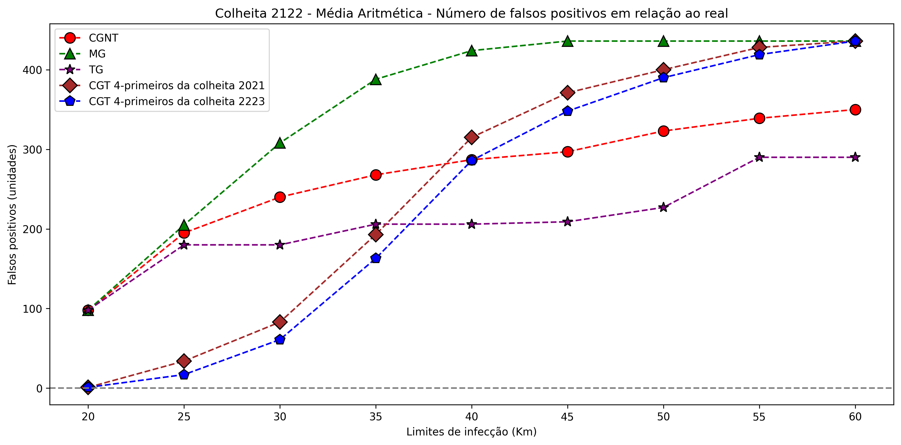
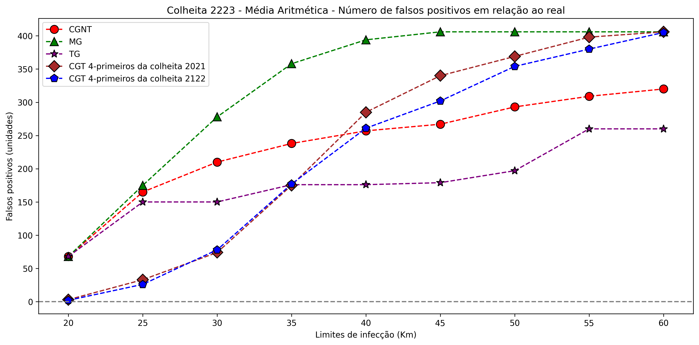

### Métrica criada para rankear as melhores soluções para cada ano:

- Foi criado uma coluna no Dataframe chamada 'biggest_error' que segue a fórmula:

```python
results['biggest_error'] = np.maximum(abs(results['days_error_mean_total'] + results['days_error_std_total']), abs(results['days_error_mean_total'] - results['days_error_std_total']))
```

Basicamente, essa coluna representa o maior erro possível que o modelo pode cometer em relação aos dias adiantados.

A seguir, as tabelas com os resultados obtidos (desconsiderando CGT com raio < 55 e descartando modelos base com raio < 25):

### Safra 2021

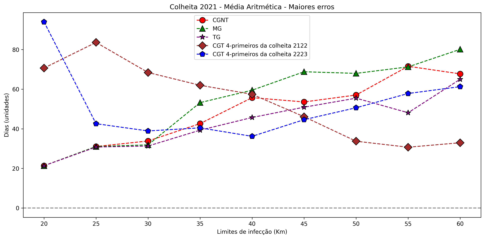

|growth_type|radius|train_file|days_error_mean_total   |days_error_std_total|true_positive|false_positive|biggest_error|precision|recall|accuracy|f1_score|
|-----------|------|----------|------------------------|--------------------|-------------|--------------|-------------|---------|------|--------|--------|
|CGT        |55    |coletoressafra2122_31_23|3.4365                  |27.2701             |126          |352           |30.7066      |0.2636   |1.0   |1.0     |0.4172  |
|TG         |25    |arithmetic_mean_31_23|2.4841                  |28.3085             |126          |122           |30.7926      |0.5081   |1.0   |1.0     |0.6738  |
|CGNT       |25    |arithmetic_mean_31_23|3.4008                  |27.6578             |126          |137           |31.0586      |0.4791   |1.0   |1.0     |0.6478  |
|MG         |25    |arithmetic_mean_31_23|3.4008                  |27.6578             |126          |147           |31.0586      |0.4615   |1.0   |1.0     |0.6316  |
|TG         |30    |arithmetic_mean_31_23|1.7275                  |29.5817             |126          |122           |31.3092      |0.5081   |1.0   |1.0     |0.6738  |
|MG         |30    |arithmetic_mean_31_23|1.6204                  |30.2788             |126          |250           |31.8992      |0.3351   |1.0   |1.0     |0.502   |
|CGT        |60    |coletoressafra2122_31_23|10.0079                 |22.9605             |126          |377           |32.9684      |0.2505   |1.0   |1.0     |0.4006  |
|CGNT       |30    |arithmetic_mean_31_23|0.3743                  |33.4813             |126          |182           |33.8556      |0.4091   |1.0   |1.0     |0.5806  |
|TG         |35    |arithmetic_mean_31_23|-1.8585                 |37.4467             |126          |148           |39.3052      |0.4599   |1.0   |1.0     |0.63    |
|CGNT       |35    |arithmetic_mean_31_23|-4.9458                 |37.6825             |126          |210           |42.6283      |0.375    |1.0   |1.0     |0.5455  |


### Safra 2122

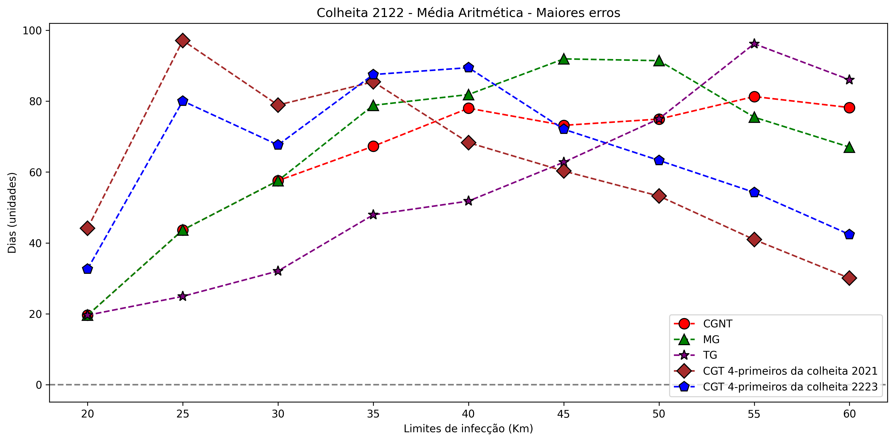

|growth_type|radius|train_file|days_error_mean_total   |days_error_std_total|true_positive|false_positive|biggest_error|precision|recall|accuracy|f1_score|
|-----------|------|----------|------------------------|--------------------|-------------|--------------|-------------|---------|------|--------|--------|
|TG         |25    |arithmetic_mean_31_23|-1.6985                 |23.235              |68           |180           |24.9335      |0.2742   |1.0   |1.0     |0.4304  |
|CGT        |60    |coletoressafra2021_31_23|-8.5                    |21.5574             |68           |436           |30.0574      |0.1349   |1.0   |1.0     |0.2378  |
|TG         |30    |arithmetic_mean_31_23|-3.777                  |28.2984             |68           |180           |32.0754      |0.2742   |1.0   |1.0     |0.4304  |
|CGT        |55    |coletoressafra2021_31_23|-15.1471                |25.7872             |68           |428           |40.9342      |0.1371   |1.0   |1.0     |0.2411  |
|CGT        |60    |coletoressafra2223_31_23|-17.9706                |24.4113             |68           |436           |42.3819      |0.1349   |1.0   |1.0     |0.2378  |
|CGNT       |25    |arithmetic_mean_31_23|-7.5147                 |36.1427             |68           |195           |43.6574      |0.2586   |1.0   |1.0     |0.4109  |
|MG         |25    |arithmetic_mean_31_23|-7.5147                 |36.1427             |68           |205           |43.6574      |0.2491   |1.0   |1.0     |0.3988  |
|TG         |35    |arithmetic_mean_31_23|-9.9436                 |37.9849             |68           |206           |47.9285      |0.2482   |1.0   |1.0     |0.3977  |
|TG         |40    |arithmetic_mean_31_23|-10.4926                |41.306              |68           |206           |51.7987      |0.2482   |1.0   |1.0     |0.3977  |
|CGT        |55    |coletoressafra2223_31_23|-24.8971                |29.3544             |68           |419           |54.2515      |0.1396   |1.0   |1.0     |0.245   |


### Safra 2223

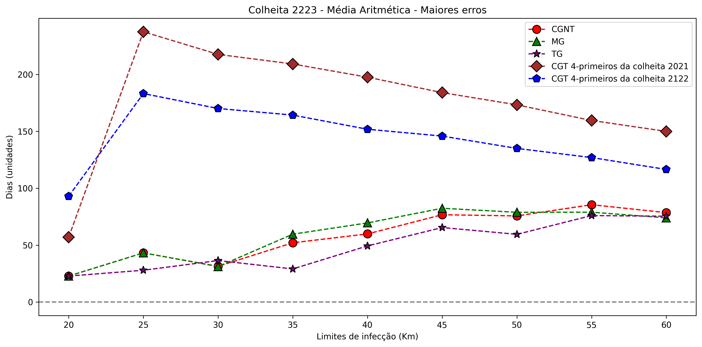

|growth_type|radius|train_file|days_error_mean_total   |days_error_std_total|true_positive|false_positive|biggest_error|precision|recall|accuracy|f1_score|
|-----------|------|----------|------------------------|--------------------|-------------|--------------|-------------|---------|------|--------|--------|
|TG         |25    |arithmetic_mean_31_23|-9.0051                 |18.9372             |98           |150           |27.9423      |0.3952   |1.0   |1.0     |0.5665  |
|TG         |35    |arithmetic_mean_31_23|-9.8435                 |19.2444             |98           |176           |29.0879      |0.3577   |1.0   |1.0     |0.5269  |
|MG         |30    |arithmetic_mean_31_23|-10.5442                |20.6407             |98           |278           |31.1849      |0.2606   |1.0   |1.0     |0.4135  |
|CGNT       |30    |arithmetic_mean_31_23|-10.6769                |20.7184             |98           |210           |31.3953      |0.3182   |1.0   |1.0     |0.4828  |
|TG         |30    |arithmetic_mean_31_23|-11.0493                |25.4053             |98           |150           |36.4547      |0.3952   |1.0   |1.0     |0.5665  |
|MG         |25    |arithmetic_mean_31_23|-13.5357                |29.6731             |98           |175           |43.2089      |0.359    |1.0   |1.0     |0.5283  |
|CGNT       |25    |arithmetic_mean_31_23|-13.5357                |29.6731             |98           |165           |43.2089      |0.3726   |1.0   |1.0     |0.5429  |
|TG         |40    |arithmetic_mean_31_23|-16.0                   |33.3082             |98           |176           |49.3082      |0.3577   |1.0   |1.0     |0.5269  |
|CGNT       |35    |arithmetic_mean_31_23|-17.8741                |34.2015             |98           |238           |52.0757      |0.2917   |1.0   |1.0     |0.4516  |
|TG         |50    |arithmetic_mean_31_23|-20.2602                |39.2304             |98           |197           |59.4906      |0.3322   |1.0   |1.0     |0.4987  |


Conseguimos perceber que levando em consideração a coluna `biggest_error` juntamente com a coluna `false_positive`, o modelo TG conseguiu os melhores resultados. 